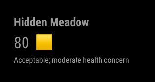

# MMM-PurpleAir

## Description
This package provides a small module for displaying air quality information from the PurpleAir api. The API reference can be [found here](https://api.purpleair.com/).



To get started place the following in your `config.js` file and edit the values as specified.
```js
{
  module: 'MMM-PurpleAir',
  position: "bottom_left",
  config: {
    apiKey: "YOUR_API_KEY_HERE",
    sensorIndex: "SENSOR_INDEX_HERE"
  },
},
```

You may add multiple sensor displays to your mirror in different positions. An example `config.js` with 2 sensor displays would be 
```js
{
  ...
  {
    module: 'MMM-PurpleAir',
    position: "bottom_left",
    config: {
        apiKey: "YOUR_API_KEY_HERE",
        sensorIndex: "SENSOR_INDEX_HERE"
    },
  },
  {
    module: 'MMM-PurpleAir',
    position: "bottom_right",
    config: {
      apiKey: "YOUR_API_KEY_HERE",
        sensorIndex: "SENSOR_INDEX_HERE"
    },
  },
  ...
},
```


## API Keys
Purple Air has a fantastic community and is verydeveloper friendly. You can acquire an API key by following the instructions in [this post](https://community.purpleair.com/t/making-api-calls-with-the-purpleair-api/180).

## Sensor index
The quickest way I have found to locate the sensor id, which is used in the `sensorIndex` field above is to go to the map located at https://map.purpleair.com/ , move to the desired location and select the marker you are interested in. 

The URL field will now look something like 
```
https://map.purpleair.com/1/mAQI/a10/p604800/cC0?select=110380#...
```
Note the value denoted by the `select` query param `110380` that is the sensor index value.

## Configuration
The additional defaults listed below can be overridden by placing new values in the coorisponding config object of your `config.js` file.

**debug** Defaults to `false`. Will produce more logs during during its operation. Useful if you are experiencing issues displaying the sensor data.

**updateIntervalSec** Defaults to `30`. The number of seconds between calls to Purple Air's API for new data. Caution, you should only adjust this value to a lower number if the rate limits on your API key can support it. 

**initialLoadDelaySec** Defaults to `3`. The number of seconds after the module starts until the first call to Purple Air for sensor data. The word `loading...` will be displayed until this first call completes. This delay can be useful to allow other modules to initialize before displaying data.
